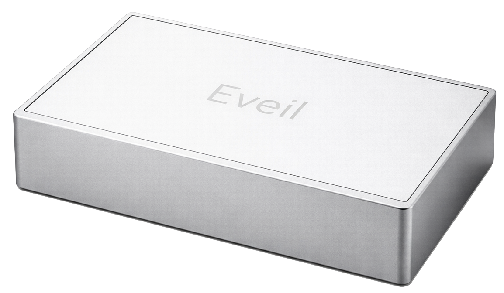

# Eveil

**The alarm that only stops when you leave the bed.**

Eveil is a hardware-software ecosystem designed for chronic oversleepers. Unlike traditional phone alarms that can be snoozed or ignored, Eveil uses **Force Sensitive Resistors (FSRs)** embedded in a bed mat to verify you are physically out of bed before the alarm stops. The iOS companion app pairs with the device over BLE, tracks your sleep via HealthKit, reads your calendar to calculate smart wake windows, and runs an escalating alarm system that cannot be dismissed by tapping a screen.



---

## Table of Contents

- [How It Works](#how-it-works)
- [System Architecture](#system-architecture)
- [Hardware](#hardware)
  - [Components](#components)
  - [Wiring](#wiring)
  - [Arduino Pinout](#arduino-pinout)
  - [ESP32 to Arduino UART](#esp32-to-arduino-uart)
  - [Communication Protocol](#communication-protocol)
  - [Arduino Command Reference](#arduino-command-reference)
- [iOS App](#ios-app)
  - [Tech Stack](#tech-stack)
  - [Project Structure](#project-structure)
  - [App-Level BLE Commands](#app-level-ble-commands)
  - [Alarm Flow](#alarm-flow)
  - [Key Features](#key-features)
  - [Permissions](#permissions)
- [Getting Started](#getting-started)
- [Build Requirements](#build-requirements)

---

## How It Works

1. The **mobile app** connects to the **ESP32** over Bluetooth Low Energy (BLE).
2. At alarm time, the app sends an arm command to the ESP32.
3. The ESP32 forwards control commands to the **Arduino** over UART serial.
4. The Arduino continuously reads all **4 FSR sensors** and reports pressure data back to the ESP32.
5. The alarm only stops when **all FSRs read zero** for a sustained period, meaning the user is out of bed.
6. If the user gets back in bed within 30 seconds, the alarm re-fires immediately.
7. **No snooze button.** By design, not by oversight.

---

## System Architecture

```
┌─────────────┐        BLE         ┌─────────────┐       UART        ┌─────────────┐
│  Mobile App │ <───────────────-> │    ESP32    │ <────────────────> │   Arduino   │
└─────────────┘                    └─────────────┘                    └──────┬──────┘
                                                                             │
                                                                    ┌────────┴────────┐
                                                                    │                 │
                                                             ┌──────┴──────┐   ┌──────┴──────┐
                                                             │ FSR Sensors │   │Piezo Buzzer │
                                                             │  (x4 mat)   │   │             │
                                                             └─────────────┘   └─────────────┘
```

| Controller | Role |
|---|---|
| **ESP32** | BLE communication, high-level alarm logic, activation countdown, command relay |
| **Arduino** | Real-time FSR reads, buzzer control, pressure reporting |

---

## Hardware

### Components

| Qty | Component | Purpose |
|-----|-----------|---------|
| 1 | ESP32 | BLE + high-level logic |
| 1 | Arduino Uno / Nano | Sensor and buzzer control |
| 4 | Force Sensitive Resistors (FSR) | Pressure detection across bed mat |
| 1 | Piezo Buzzer | Audible alarm output |
| - | Breadboard / PCB | Prototyping |
| - | Jumper Wires | Interconnects |

### Wiring

#### Arduino Pinout

The 4 FSRs are arranged across the mat to detect full-body weight distribution. All four must read zero for the alarm to stop.

| Component | Pin | Type |
|-----------|-----|------|
| FSR 1 | `A0` | Analog Input |
| FSR 2 | `A1` | Analog Input |
| FSR 3 | `A2` | Analog Input |
| FSR 4 | `A3` | Analog Input |
| Buzzer | `D8` | Digital Output |

#### ESP32 to Arduino UART

| ESP32 Pin | Arduino Pin | Function |
|-----------|-------------|----------|
| `GPIO17` (TX) | `RX` | ESP32 to Arduino |
| `GPIO16` (RX) | `TX` | Arduino to ESP32 |
| `GND` | `GND` | Common Ground |

**Baud rate:** `9600` on both sides.

### Communication Protocol

The Arduino and ESP32 communicate via newline-terminated strings (`\n`).

**Arduino to ESP32** (sensor data, sent continuously while armed):
```
FSR:423,0,817,0
```
Four comma-separated analog readings from A0-A3.

**ESP32 to Arduino** (commands):
```
ALARM_START
ALARM_STOP
MANUAL_NOISE
MANUAL_STOP
TEST_ALARM
```

### Arduino Command Reference

| Command | Effect |
|---------|--------|
| `ALARM_START` | Arms the system, begins FSR reads and data reporting |
| `ALARM_STOP` | Disarms system, silences buzzer |
| `MANUAL_NOISE` | Forces buzzer on immediately; auto-stops when all FSRs hit zero, re-triggers if pressure returns |
| `MANUAL_STOP` | Kills buzzer and disarms regardless of FSR state |
| `TEST_ALARM` | Runs a 2-second warble test of the buzzer |

---

## iOS App

### Tech Stack

| Layer | Technology |
|---|---|
| Language | Swift 5 |
| UI | SwiftUI |
| Persistence | SwiftData |
| Alarms | AlarmKit |
| Health data | HealthKit |
| On-device AI | Foundation Models (`FoundationModels` / `@Generable`) |
| Hardware comms | CoreBluetooth (Nordic UART Service) |
| Calendar | EventKit |
| Auth | Sign in with Apple |
| Cloud sync | CloudKit (entitlement configured) |
| Min deployment | iOS 26 |

### Project Structure

```
Eveil/
├── EveilApp.swift              # App entry point, SwiftData container, BLE + alarm bootstrap
├── ContentView.swift           # Root view: onboarding gate, tab router, escalation & success overlays
├── Info.plist                  # Background modes (BLE, audio, fetch, processing), AlarmKit usage, URL scheme
├── Eveil.entitlements          # HealthKit, CloudKit, Sign in with Apple, push notifications
│
├── Models/
│   ├── AlarmConfig.swift       # SwiftData model - alarm schedule, escalation timing, sound pack
│   ├── CalibrationProfile.swift# SwiftData model - per-zone empty/occupied pressure baselines
│   └── SleepSession.swift      # SwiftData model - bed/wake times, movement events, wake accuracy
│
├── Managers/
│   ├── BLEManager.swift        # CoreBluetooth central - scan, connect, UART send/receive, auto-reconnect
│   ├── AlarmOrchestrator.swift # Watches AlarmKit state, runs escalation countdown, triggers device alarm
│   ├── HealthKitManager.swift  # Reads sleep stages, HR, HRV, respiratory rate; computes daily breakdowns
│   └── WakeBufferEstimator.swift # On-device LLM call to estimate wake-up lead time from calendar events
│
├── Views/
│   ├── LaunchScreenView.swift  # Animated dot-wave launch screen with haptic pulses
│   ├── Onboarding/
│   │   ├── OnboardingView.swift        # Sign in with Apple + video background
│   │   ├── PermissionsView.swift       # Health, Bluetooth, Notifications, Calendar permission requests
│   │   ├── NameInputView.swift         # User name entry
│   │   ├── AgeInputView.swift          # Age input
│   │   ├── MorningStrugglesView.swift  # Morning difficulty self-assessment
│   │   ├── PreparationTimeView.swift   # Default wake buffer configuration
│   │   ├── GreetingTransitionView.swift# Personalized welcome transition
│   │   └── LoopingVideoPlayer.swift    # AVPlayer wrapper for background video
│   ├── Today/
│   │   └── TodayView.swift     # Dashboard - alarm status, next event, sleep summary, device status
│   ├── Sleep/
│   │   └── SleepView.swift     # Sleep history, stage charts, weekly trends, health metrics
│   ├── Alarm/
│   │   └── AlarmView.swift     # Alarm configuration - schedule, sounds, escalation settings
│   ├── Device/
│   │   └── DeviceView.swift    # BLE pairing, live sensor view, calibration flow, UART console
│   └── Settings/
│       └── SettingsView.swift  # Account, preferences, integrations
│
└── Assets.xcassets/            # App icon, brand images, background
```

### App-Level BLE Commands

The iOS app communicates with the ESP32 over BLE using the Nordic UART Service (NUS). The ESP32 relays these as needed to the Arduino.

| Command | Purpose |
|---|---|
| `ARM` | Start streaming sensor readings |
| `FORCE ALARM` | Trigger the onboard hardware speaker |
| `ALARM KILL` | Stop the hardware alarm |
| `INFO` | Request firmware version (`FW:x.y.z` response) |

Raw sensor data arrives as 12-bit ADC readings (0-4095), normalized to 0.0-1.0 in the app.

### Alarm Flow

```
AlarmKit fires system alarm
         │
         ▼
   User taps "I'm up"
         │
         ▼
  ┌──────────────────┐
  │ Bed empty?       │──── Yes ──> Success overlay ("You're up!")
  └──────────────────┘
         │ No
         ▼
  10-second countdown
  (checks pressure each second)
         │
         ▼
  ┌──────────────────┐
  │ Still in bed?    │──── No ──> Success
  └──────────────────┘
         │ Yes
         ▼
  FORCE ALARM -> device speaker
  (loops until bed is empty for 2+ seconds)
         │
         ▼
  Alarm killed, 30-second watch period
  (if user returns to bed, alarm re-fires immediately)
         │
         ▼
  Stayed up for 30s -> Success
```

### Key Features

**On-device AI wake buffer** - `WakeBufferEstimator` uses Apple's `FoundationModels` framework with a `@Generable` struct to ask an on-device language model how many minutes before a calendar event the user should wake up, taking into account event type, time, and context.

**HealthKit integration** - Reads sleep stages (deep, core, REM, awake), heart rate, HRV, respiratory rate, and SpO2 from Apple Watch / Oura Ring data. Displays nightly breakdowns and weekly trends.

**Calibration system** - The `CalibrationProfile` stores per-zone empty and occupied baselines. Occupancy detection uses a 40% threshold between empty and occupied readings per zone.

**Background BLE** - Uses `CBCentralManager` state restoration (`willRestoreState`) and the `bluetooth-central` background mode for persistent device connectivity. Auto-reconnects on unexpected disconnects.

**Escalation overlays** - Full-screen countdown overlay with large numeric display that turns red at 3 seconds. Success overlay with spring animation when the user gets up.

### Permissions

| Permission | Reason |
|---|---|
| Bluetooth | Device communication via BLE |
| Notifications | Alarm delivery and escalation alerts |
| HealthKit | Sleep and heart rate data import |
| Calendar | Wake window calculation from events |
| Background Modes | `bluetooth-central`, `audio`, `fetch`, `processing`, `remote-notification` |

---

## Getting Started

### Hardware

1. Wire up the FSR mat, Arduino, and ESP32 according to the pinout tables above
2. Flash the Arduino sketch and ESP32 firmware
3. Verify UART communication at 9600 baud between the two boards

### iOS App

1. Open `Eveil.xcodeproj` in Xcode
2. Select your development team under Signing & Capabilities
3. Build and run on a physical iOS device (BLE requires real hardware)
4. On first launch, sign in with Apple and grant permissions through the onboarding flow
5. Pair your Eveil hardware device from the **MyEveil** tab

> **Note:** The simulator cannot use CoreBluetooth. A physical device is required for full functionality.

---

## Build Requirements

- Xcode 26+
- iOS 26+
- Physical iOS device for BLE features
- ESP32 dev board with BLE support
- Arduino Uno or Nano
- 4x FSR sensors + piezo buzzer

---
